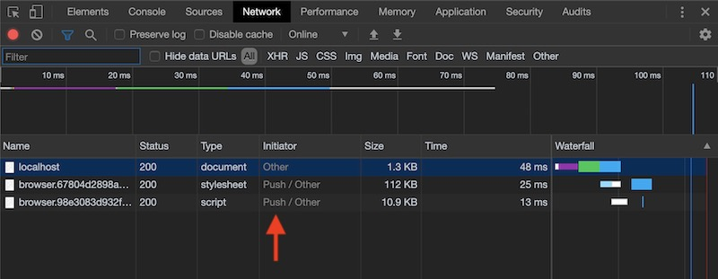

# http/2 webapp demo

This project demos a [Preact][preact] + [Node.js][node] web application with a [nginx](https://nginx.org) reverse proxy serving via [HTTP/2][http2].

## How it works

1. The app is built with [Webpack][webpack]
    * Server and client are built as separate, standalone bundles
    * CSS is extracted via the [MiniCssExtractPlugin](https://webpack.js.org/plugins/mini-css-extract-plugin/)
    * Webpack's [manifest plugin](https://www.npmjs.com/package/webpack-manifest-plugin) emits a `manifest.json` with the content-hashed filenames
2. [docker-compose](https://docs.docker.com/compose/) stiches the Node.js application with a [nginx](https://nginx.org) reverse proxy, with configuration at [nginx/server.conf](./nginx/server.conf)
3. The running Node.js application serves server-side rendered content
    * It reads the `manifest.json` and adds the CSS and JS files as [`Link` headers](https://developer.mozilla.org/en-US/docs/Web/HTTP/Headers/Link)
    * The CSS and JS files are also added as `<link rel="stylesheet">` and `<script>` tags
4. nginx [interprets the `Link` headers](https://www.nginx.com/blog/nginx-1-13-9-http2-server-push/#automatic-push) and uses http/2 server push on the CSS and JS assets
    * nginx is also configured to serve these static assets
5. The Preact [re-hydrates](https://preactjs.com/guide/v10/api-reference#hydrate) the application on the client

## Running locally

(Make sure you have [Docker](https://www.docker.com/get-started) installed.)

1. Generate and trust certs:

    ```shell
    ./scripts/certs.sh
    ```

    Follow the `sudo security add-trusted-cert` instruction to trust the certificate on your machine.
2. Build the app image:

    ```shell
    docker-compose build
    ```

3. Start

    ```shell
    docker-compose up
    ```

4. Visit <https://localhost:4000/>
5. You will see a different initiator in your browser's network tab. For example, in Chrome:

    

[http2]: https://en.wikipedia.org/wiki/HTTP/2
[nginx]: https://nginx.org
[node]: https://nodejs.org/en/
[preact]: https://preactjs.com
[typescript]: https://www.typescriptlang.org
[webpack]: https://webpack.js.org